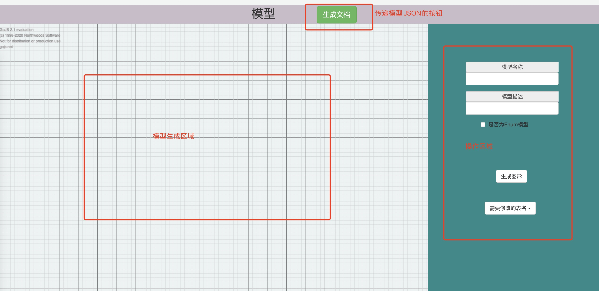
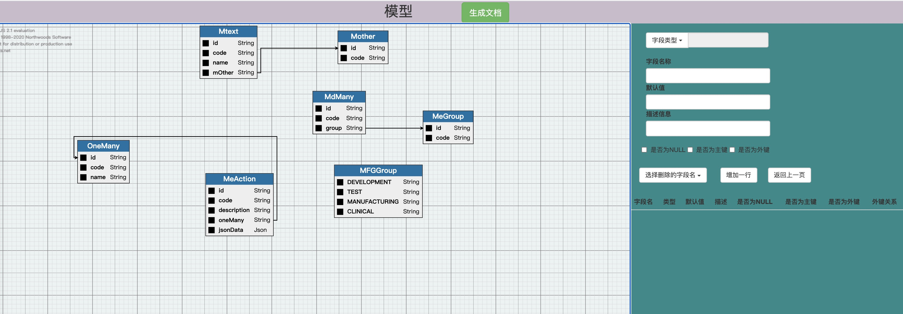

# databaseSchema

## 简介

目的是构造一个JSON文件,文件包含所有的表关系,服务可以获取该JSON文件来自定义自己的构造格式。

### 支持类型

1. 支持数据库模型
2. 支持枚举类型
3. 字段的类型通过yml配置来维护

### 创建模型

1. 创建数据库模型时不勾选是否为Enum模型,填写模型名称和模型描述即可
2. 创建Enum枚举模型时勾选是否为Enum模型,填写模型名称和模型描述即可

> 注意: 模型初始位置都为(0.0),需要手动拖动调节位置，不然回模型重叠在一起

### 添加字段

1. 非枚举模型的添加字段，必填项为`字段名称`和`字段类型`
2. 选择外键时,对应的外键模型必须已经创建了,否则无法选择并创建

### 修改模型信息

1. 选择需要修改的表名后跳转到操作界面
2. 可以新增字段
3. 可以点击删除，选择对应的字段

## 服务启动

1. `npm i`
1. `npm run start`
